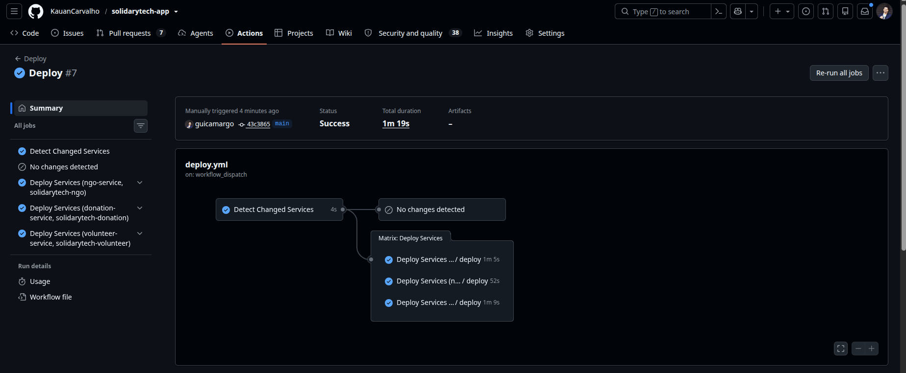

# 🚀 SolidaryTech — App (Hackathon Fase 5)

Turma: **2DCLT** — DevOps e Arquitetura Cloud Pós Tech.

## Integrantes do Grupo

| Nome | RM |
| :--- | :--- |
| Guilherme Correa Camargo | 369954 |
| Kauan Carvalho Calasans | 370203 |
| Pedro Henrique Coittinho Marcondes de Andrade | 369367 |

Repositório de GitOps/Infra (Terraform, Kubernetes, ArgoCD, observabilidade): [solidarytech-gitops](https://github.com/KauanCarvalho/solidarytech-gitops)
Vídeo de demonstração: _(adicionar link antes da entrega)_

---

## 1. Visão geral

Este repositório contém o código-fonte, a containerização, os testes de integração e as pipelines de CI/CD (build, lint, SAST/SCA, deploy com GitOps commit-back) dos 3 microsserviços da **SolidaryTech** — plataforma fictícia de ONGs proposta no Hackathon da Fase 5. Código de negócio importado e adaptado a partir do repositório-base fornecido pela FIAP ([`dougls/hackathon-DCLT`](https://github.com/dougls/hackathon-DCLT)).

| Serviço | Linguagem | Porta | Persistência | Papel |
| :--- | :--- | :--- | :--- | :--- |
| `ngo-service` | Python 3.11 / Flask | 8081 | PostgreSQL (`ngo_db`) | Cadastro e gestão de ONGs parceiras |
| `donation-service` | Go 1.25 | 8082 | PostgreSQL (`donation_db`) + AWS SQS | **Caminho crítico / Hot Path** — processamento de doações |
| `volunteer-service` | Python 3.11 / Flask | 8083 | AWS DynamoDB (`SolidaryTechVolunteers`) | Match entre voluntários e ONGs |

A instrumentação de código (OpenTelemetry), pipelines de CI/DevSecOps (Build, Lint, SAST/SCA, Docker, ECR) residem neste repositório. Manifestos Kubernetes, Terraform e a stack de observabilidade residem no repositório de GitOps.

---

## 2. Decisões tomadas

Decisões estruturais deste projeto e o porquê — detalhamento completo na tabela de critérios de aceite (seção 7).

- **2 repositórios separados (app + gitops)**, em vez de monorepo — espelha exatamente o padrão já usado e avaliado nas Fases 1-4 (`fiap-dac-toggle-master` + `fiap-dac-toggle-master-gitops`). Reduz risco de fugir do que já funcionou e mantém CI (build/scan/push) e CD (ArgoCD) com responsabilidades separadas.
- **AWS Academy Learner Lab mantido** como conta AWS — reaproveita o `LabRole` fixo e o fluxo de credenciais efêmeras (session token) já configurado pelo time nas fases anteriores, em vez de migrar para conta própria (o que geraria custo real ao longo dos 2 meses do hackathon).
- **Datadog mantido como APM/AIOps** — reuso da configuração já validada (Watchdog, pipelines de log, Distributed Tracing) em vez de trocar de ferramenta, reduzindo risco de retrabalho.
- **Sem framework de unit tests** — o repositório-base não trouxe testes, e o precedente já avaliado nas fases anteriores usa smoke tests via shell script (`scripts/check/`) batendo em endpoints reais como critério de verificação. Mantido aqui pelo mesmo motivo: é o padrão já aceito em avaliação.
- **`Werkzeug` fixado explicitamente** (`==2.2.2`) junto de `Flask==2.2.2` nos serviços Python — sem o pin, o `pip install` resolve uma versão nova de Werkzeug incompatível com Flask 2.2.2 (`ImportError: cannot import name 'url_quote'`), quebrando o container em runtime. Descoberto ao rodar `make check-all` de ponta a ponta durante o desenvolvimento.
- **Clientes AWS (boto3 e aws-sdk-go) apontando explicitamente para `AWS_ENDPOINT_URL`** quando definido — o código-base do hackathon-DCLT não lia essa variável, então em dev local (LocalStack) as chamadas caíam na AWS real e falhavam com `InvalidClientTokenId`/`UnrecognizedClientException`. Corrigido no `donation-service` (Go, via `aws.Config.Endpoint`) e no `volunteer-service` (Python, via `boto3.resource(..., endpoint_url=...)`); em produção a variável simplesmente não é definida e o SDK usa o endpoint real da AWS normalmente.

---

## 3. Estrutura do repositório

```text
.
├── .env.dev.sample / .env.prod.sample
├── .github/
│   ├── actions/detect-runtime/action.yml
│   └── workflows/
│       ├── ci.yml              # build + lint + Trivy SCA + SonarCloud SAST
│       ├── deploy.yml          # build imagem + Trivy image scan + push ECR + commit-back GitOps
│       ├── reusable-deploy.yml
│       ├── reusable-sca.yml
│       └── self-healing.yml    # disparado por alerta (repository_dispatch) ou manual
├── .trivy.yaml / .trivyignore
├── Makefile
├── docker-compose.yml          # stack local enxuta
├── docker-compose.local.yml    # + stack completa de observabilidade (otelcol/tempo/prometheus/loki/grafana)
├── local/
│   ├── observability/          # configs do docker-compose.local.yml
│   └── services/
│       ├── ngo-service/        # Python
│       ├── donation-service/   # Go
│       └── volunteer-service/  # Python
└── scripts/check/               # smoke tests (mesmo padrão do repo de referência)
```

---

## 4. Pré-requisitos

- Docker + Docker Compose
- Go 1.25+ (apenas para desenvolvimento local fora de container)
- Python 3.11+ (idem)
- `make`

---

## 5. Passo a passo de execução local

```bash
# 1. Sobe a stack enxuta (Postgres ×2, LocalStack, os 3 serviços)
make docker-up ENV=dev

# 2. Cria a fila SQS e a tabela DynamoDB no LocalStack
make localstack-setup

# 3. Valida o ecossistema ponta a ponta
make check-all ENV=dev

# 4. (Opcional) Stack completa de observabilidade local
docker compose -f docker-compose.local.yml --env-file .env.dev up --build
# Grafana → http://localhost:3000 · Prometheus → http://localhost:9090 · Tempo → http://localhost:3200

# Derruba tudo (incluindo volumes/imagens)
make kaboom
```

Este fluxo (subir stack → criar recursos no LocalStack → `make check-all`) foi validado de ponta a ponta durante o desenvolvimento — os 3 serviços respondem, persistem dados e o smoke test completo passa.

---

## 6. Testes / verificação

Sem unit tests (ver "Decisões tomadas"). Verificação via `scripts/check/`:

```bash
make check ngo-service          # ou donation-service / volunteer-service
make check-all ENV=prod         # contra o ambiente publicado (lê *_SERVICE_URL de .env.prod)
```

---

## 7. Critérios de aceite atendidos (parte deste repositório)

A tabela completa (todos os requisitos do edital) está em [`solidarytech-gitops`](https://github.com/KauanCarvalho/solidarytech-gitops); abaixo, apenas os itens cuja evidência principal vive **neste** repositório.

| # | Requisito (PDF) | Status | Evidência | Por quê |
|---|---|---|---|---|
| 0.1 | Dockerfiles otimizados p/ os 3 serviços | ✅ | `local/services/*/Dockerfile` — multi-stage, imagem final distroless (Go)/slim+nonroot (Python) | Reduz superfície de ataque e tamanho de imagem; mesmo padrão já avaliado nas fases 1-4 |
| 0.3 | CI/CD com testes, SAST/SCA (Trivy/Sonar), build de imagem | ✅ | `.github/workflows/ci.yml` (Trivy fs + SonarCloud, gate bloqueante) e `deploy.yml` (Trivy image scan bloqueante) | Gate bloqueante — não apenas informativo — é o que demonstra DevSecOps de fato |
| 0.4 (parcial) | GitOps — sem `kubectl apply` manual | ✅ | `reusable-deploy.yml` só faz commit-back no repo gitops; nunca `kubectl apply` | Exigência literal da "Regra de Ouro" do edital |
| 0.5 (parcial) | Instrumentação OTel + Distributed Tracing | ✅ | `donation-service`: SDK OTel manual (`otel.go`/`metrics.go`); `ngo-service`/`volunteer-service`: `opentelemetry-bootstrap` + métricas manuais via `before_request`/`after_request` | Necessário para o dashboard SRE e para tracing cross-service (item 0.5 completo, incl. stack de coleta, está no repo gitops) |

📸 **Evidência visual:** _(inserir screenshot antes da entrega)_


---

## 8. Links

- Repositório GitOps: https://github.com/KauanCarvalho/solidarytech-gitops
- Código-fonte base fornecido: https://github.com/dougls/hackathon-DCLT
- Vídeo de demonstração: _(adicionar antes da entrega)_
